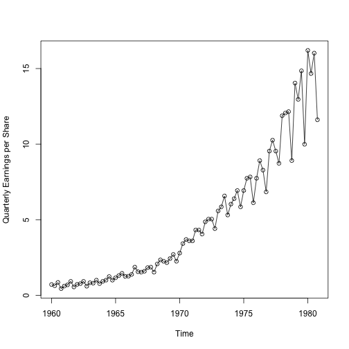
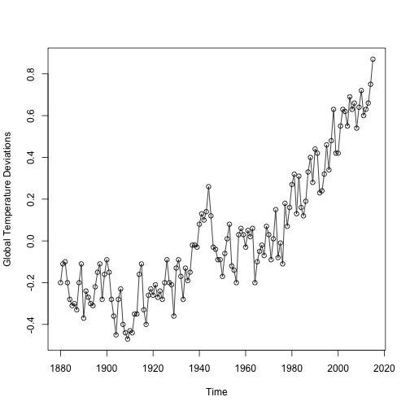

Introduction to Time Series Modeling
========================================================
author: Steven Moen
date: 9/12/19 - 9/13/19
autosize: true

Day 1 Agenda
========================================================

- Examples of time series data
- Key Tools
- Important Assumptions
- Autoregressive (AR) Models
- Moving-Average (MA) Models
- Autoregressive Moving-Average (ARMA) Models

Day 2 Agenda
========================================================

- Autoregressive Moving-Average (ARMA) Models (continued)
- Model Diagnostics
- Real Data Analysis
- Introduction to Frequency Domain

Special Thanks
========================================================

Many of the examples and theory used in this presentation can be found in Time Series Analysis and Its Applications by Robert H. Shumway and David S. Stoffer. 

Thanks to Jess and Rick with all their help putting this together.

My Background
========================================================

- Rice University '14
- 4 years of work experience at Capital One
- M.S. in Statistics, UChicago
- Currently working with Dr. Wei Biao Wu

Examples of Time Series Data 
========================================================

A plot of quarterly earnings per share from Johnson and Johnson, from Shumway and Stoffer.

Examples of Time Series Data
========================================================

A plot of global temperature deviations, also from Shumway and Stoffer.

Key Tools
========================================================

A common assumption in statistical modeling is independent and identically distributed noise, often abbreviated as i.i.d.

Two random variables $A$ and $B$ are independent if and only if the following is true:

$$
  \begin{aligned}
  \mathbb{P}(A \cap B) = \mathbb{P}(A)\mathbb{P}(B)
  \end{aligned}
$$

Why would this pose a problem when modeling time series?

Key Tools
========================================================

- Intuitively, someone who studies time series often cares about intertemporal dependencies. 
- Time series analysis incorporates several tools designed used to analyze the intertemporal relationships within a time series and the relationships between time series.

Key Tools
========================================================

What are some of these tools?

- Expected Value
- Autocovariance Function
- Autocorrelation Function
- Cross-Covariance Function
- Cross-Correlation Function

Key Tools: Expected Value
========================================================

The mean function of a time series is defined as follows:

$$
  \begin{aligned}
  \mu_{xt} = \mathbb{E}(x_t) = \int_{-\infty}^{\infty} x f_t(x)dx
  \end{aligned}
$$

where $\mathbb{E}$ is the expected value operator.

Aside: Random Walk with Drift Model
========================================================

For many of these exercises, we will work with a random walk with drift model, which is defined by:

$$
  \begin{aligned}
  \mu_{xt} = \mathbb{E}(x_t) = \int_{-\infty}^{\infty} x f_t(x)dx
  \end{aligned}
$$

where $w_t$ is a white noise series defined by:

$$
  \begin{aligned}
  w_t \sim \text{wn}(0, \sigma_m^2)
  \end{aligned}
$$

Aside: White noise
========================================================

White noise can take on many different formulations. The below are ordered from least restrictive to most restrictive:

- A series of uncorrelated random variables with mean 0 and finite variance $\sigma_w^2$
- A series of i.i.d. random variables with zero mean
- Gaussian white noise, where the noise random variables are $w_t \overset{\text{i.i.d.}}{\sim} \mathcal{N}(0, \sigma_w^2)$

Aside: White noise
========================================================

According to Shumway and Stoffer, the designation "white" refers to the "analyogy with white light and indicates all possible periodic ocillations are present with equal strength".

Aside: Random Walk with Drift Model
========================================================

This model is very useful in applications such as financial economics, since a random walk often accurately captures the seemingly "random" developments of market participants quickly incorporating relevant information into an asset's price. See "A Random Walk Down Wall Street".

Key Tools: Autocovariance
========================================================

The autocovariance function of a time series is defined as follows:

$$
  \begin{aligned}
  \gamma_x(s,t) = cov(x_s, x_t) = \mathbb{E}[(x_s - \mu_s)(x_t - \mu_t)]
  \end{aligned}
$$

for all $s$ and $t$. 

Key Tools: Autocovariance
========================================================

- According to Shumway and Stoffer, the "autocovariance measures the linear dependence between two points on the same series observed at different times"
- Remember, a covariance of 0 does NOT in general imply that two points in a series are independent

Exercise: Finding the Autocovariance of a Random Walk with Drift
========================================================

Compute the expectation of a random walk with drift model given in the previous slides and restated below:

$$
  \begin{aligned}
  x_t = \delta t + \sum_{j=1}^t w_j,
  t = 1,2,....
  \end{aligned}
$$

where $w_t$ is a white noise series defined by:

$$
  \begin{aligned}
  w_t \sim \text{wn}(0, \sigma_m^2)
  \end{aligned}
$$

Feel free to compute this using a pencil and paper, or using LaTeX (if you're familiar with it) in the TS_Exercises.Rmd file.

Solution: Finding the Autocovariance of a Random Walk with Drift
========================================================

The autocovariance of a random walk with drift is as follows:

$$
  \begin{aligned}
  \mathbb{E}(x_t) = \delta t
  \end{aligned}
$$

Please refer to the .Rmd file for a more in-depth solution.

Exercise: Finding the Autocovariance of a Random Walk with Drift
========================================================

Compute the autocovariance of a random walk with dri

$$
  \begin{aligned}
  x_t = \delta t + \sum_{j=1}^t w_j,
  t = 1,2,....
  \end{aligned}
$$

where $w_t$ is a white noise series defined by:

$$
  \begin{aligned}
  w_t \sim \text{wn}(0, \sigma_m^2)
  \end{aligned}
$$

Feel free to compute this using a pencil and paper, or using LaTeX (if you're familiar with it) in the TS_Exercises.Rmd file.

Solution: Finding the Expected Value of a Random Walk with Drift
========================================================

The expected value of a random walk with drift is as follows:

$$
  \begin{aligned}
  \gamma_x(s,t) = \min(s,t) \sigma_w^2
  \end{aligned}
$$

Please refer to the .Rmd file for a more in-depth solution.

Important Assumptions: Strong Stationarity
========================================================

The definition of a strictly stationary time series, according to Shumway and Stoffer, is that the "probabilistic behavior of every collection of values" $x_{t1}, x_{t2}, ..., x_{tk}$ "is identical to that of the shifted set" $x_{t1+h}, x_{t2+h}, ..., x_{tk+h}$.

- This assumption is not widely used in applications as it implies that the distribution must be constant at every value in a time series

Important Assumptions: Weak Stationarity
========================================================

According to Shumway and Stoffer, a weakly stationary series $x_t$ is given by the following:

- The mean value function, $\mu_t$ is constant and does not depend on the time
- The autocovariance function, $\gamma(s,t)$ depends on s and t only through their difference $|s-t|$

Important Assumptions: Verification (Exercise)
========================================================

Are the following time series weakly stationary?

1. $x_t = \delta t + \sum_{j=1}^t w_j, t = 1,2,....$
2. $v_t = \frac{1}{3}(w_{t-1} + w_t + w_{t+1})$

Important Assumptions: Verification (Exercise)
========================================================

1. $x_t = \delta t + \sum_{j=1}^t w_j, t = 1,2,....$
- No
2. $v_t = \frac{1}{3}(w_{t-1} + w_t + w_{t+1})$
- Yes

Please refer to the .Rmd file for a more in-depth solution.

Autoregressive Models
========================================================

We will get to real data analysis soon, but we need to define a few key models which we will use soon.

An autoregressive model of order p is defined as follows:

$$
x_t = \phi_1 x_{t-1} + \phi_2 x_{t-2} + ... + \phi_p x_{t-p} + w_t
$$

where:

- $x_t$ is stationary
- $w_t \sim wn(0, \sigma_w^2)$
- $\phi_1, ..., \phi_p$ are non-zero constants 
- $x_t$ has mean 0

Aside: Backshift Operator
========================================================

The backshift operator is defined as follows:

$$
B x_t = x_{t-1}
$$

and can be extended as follows:

$$
B^2 x_t = B(Bx_{t}) = Bx_{t-1} = x_{t-2}
$$

Autoregressive Operator
========================================================

Below is the autoregressive operator. It will be useful when we discuss ARMA models.

$$
\phi(B) = 1 - \phi_1 B - \phi_2 B^2 - ... - \phi_p B^p
$$

Using this, the initial AR model can be written as:

$$
(1 - \phi_1 B - \phi_2 B^2 - ... - \phi_p B^p)x_t = w_t
$$

or alternatively as:

$$
(\phi(B))x_t = w_t
$$

Example: An AR(1) Model
========================================================

An autoregressive model can be written as follows:

$$
x_t = \phi x_{t-1} + w_t = \phi(\phi x_{t-2} + w_{t-1}) + w_t
$$
$$
= \phi^2 x_{t-2} + \phi w_{t-1} + w_t
$$
$$
= \phi^k x_{t-k} + \sum_{j=0}^{k-1} \phi^j w_{t-j}
$$

Example: An AR(1) Model
========================================================

An autoregressive model can be written as follows:

$$
x_t = \phi x_{t-1} + w_t = \phi(\phi x_{t-2} + w_{t-1}) + w_t
$$
$$
= \phi^2 x_{t-2} + \phi w_{t-1} + w_t
$$
$$
= \phi^k x_{t-k} + \sum_{j=0}^{k-1} \phi^j w_{t-j}
$$

Thus, if $|\phi| < 1 \text{ and } \mathbb{V}(x_t) < \infty$ for all t, then we can represent the AR(1) as a linear process given by:

$$
x_t = \sum_{j=0}^\infty \phi^j w_{t-j}
$$

Moving Average Models
========================================================

A moving average model of order q is defined as follows:

$$
x_t =  w_t + \theta_1 w_{t-1} + \theta_2 w_{t-2} + ... + \theta_p w_{t-p}
$$

where:

- $x_t$ is stationary
- $w_t \sim wn(0, \sigma_w^2)$
- $\theta_1, ..., \theta_p, \theta_p \neq 0$ are parameters 
- $x_t$ has mean 0

Moving Average Operator
========================================================

The moving average operator is given by

$$
\theta(B) = 1 + \theta_1 B + \theta_2 B^2 + ... + \theta_q B^q
$$

which allows the model on the previous slide to be written as:

$$
x_t = \theta(B) w_t
$$

Autoregressive Moving Average Models
========================================================

An ARMA(p,q) time series is described below

$$
x_t = \phi_1 x_{t-1} + ... + \phi_p x_{t-p} + w_t + \theta_1 w_{t-1} + ... + \theta_q w_{t-q}
$$

where:

- $\phi_p \ne 0$
- $\phi_q \ne 0$
- $\sigma_w^2 > 0$
- The series is mean 0
- The series is stationary

Diagnostics
========================================================

We've defined some useful models, but how do we work with them? We need tools to balance out the bias-variance tradeoff.

- Let's look at the plot from The Elements of Statistical Learning on Page 37

Diagnostics
========================================================

There are three tools commonly used to measure the bias-variance tradeoff in time series

- AIC
- AICc
- BIC

Diagnostics - AIC
========================================================

The AIC is defined as follows:

$$
AIC = \log \hat{\sigma_k}^2 + \frac{n+2k}{n}
$$

- The AIC is biased, but people use it still because "there is no true model" in applications

Diagnostics - AIC
========================================================

The AICc is defined as follows:

$$
AICc = \log \hat{\sigma_k}^2 + \frac{n+k}{n-k-2}
$$

Diagnostics - BIC
========================================================

The BIC is defined as follows:

$$
BIC = \log \hat{\sigma_k}^2 + \frac{k \log n}{n}
$$

- The BIC tends to choose smaller models

Thanks!
========================================================

More to come tomorrow!
