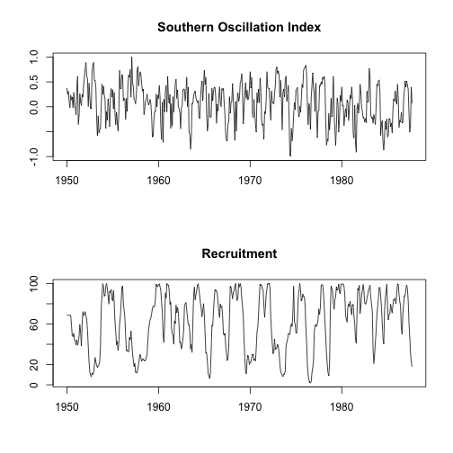

Introduction to Time Series Modeling
========================================================
author: Steven Moen
date: 9/12/19 - 9/13/19
autosize: true

Day 1 Agenda
========================================================

- Examples of time series data
- Key Tools
- Important Assumptions
- Autoregressive (AR) Models
- Moving-Average (MA) Models
- Autoregressive Moving-Average (ARMA) Models

Day 2 Agenda
========================================================

- Autoregressive Moving-Average (ARMA) Models (continued)
- Model Diagnostics
- Real Data Analysis
- Introduction to Frequency Domain

Special Thanks
========================================================

Many of the examples used in this presentation can be found in Time Series Analysis and Its Applications by Robert H. Shumway and David S. Stoffer.

Examples of Time Series Data 
========================================================

This example is from Shumway and Stoffer.

Examples of Time Series Data
========================================================

Also from Shumway and Stoffer.

Examples of Time Series Data
========================================================

Also from Shumway and Stoffer.

Key Tools
========================================================

A common assumption in statistical modeling is independent and identically distributed noise, often abbreviated (i.i.d.).

Two random variables $A$ and $B$ are independent if and only if the following is true:

$$
  \begin{aligned}
  \mathbb{P}(A \cap B) = \mathbb{P}(A)\mathbb{P}(B)
  \end{aligned}
$$

Why would this pose a problem when modeling time series?

Key Tools
========================================================

Intuitively, someone who studies time series often cares about intertemporal dependencies. Time series analysis uses several tools that are commonly used to analyze the intertemporal relationships within a time series and the relationships between time series.

Key Tools
========================================================

What are some of these tools?

- Expected Value
- Autocovariance Function
- Autocorrelation Function
- Cross-Covariance Function
- Cross-Correlation Function

Key Tools: Expected Value
========================================================

The mean function of a time series is defined as follows:

$$
  \begin{aligned}
  \mu_{xt} = \mathbb{E}(x_t) = \int_{-inf}^{inf} x f_t(x)dx
  \end{aligned}
$$

where $\mathbb{E}$ is the expected value operator.

Aside: Random Walk with Drift Model
========================================================

For many of these exercises, we will work with a random walk with drift model, which is defined by:

$$
  \begin{aligned}
  \mu_{xt} = \mathbb{E}(x_t) = \int_{-\infty}^{\infty} x f_t(x)dx
  \end{aligned}
$$

where $w_t$ is a white noise series defined by:

$$
  \begin{aligned}
  w_t \sim \text{wn}(0, \sigma_m^2)
  \end{aligned}
$$

Aside: White noise
========================================================

White noise can take on many different formulations. The below are ordered from least restrictive to most restrictive:

- A series of uncorrelated random variables with mean 0 and finite variance $\sigma_w^2$
- A series of i.i.d. random variables with zero mean
- Gaussian white noise, where the noise random variables are $w_t \overset{\text{i.i.d.}}{\sim} \mathcal{N}(0, \sigma_w^2)$

Aside: White noise
========================================================

According to Shumway and Stoffer, the designation "white" refers to the "analyogy with white light and indicates all possible periodic ocillations are present with equal strength".

[ADD PLOTS]

Aside: Random Walk with Drift Model
========================================================

This model is very useful in applications such as financial economics, since a random walk often accurately captures the seemingly "random" developments of market participants quickly incorporating relevant information into an asset's price. See "A Random Walk Down Wall Street".

[INSERT QUOTE]

Exercise: Finding the Expected Value of a Random Walk with Drift
========================================================

Compute the expectation of a random walk with drift model given in the previous slides and restated below:

$$
  \begin{aligned}
  x_t = \delta t + \sum_{j=1}^t w_j,
  t = 1,2,....
  \end{aligned}
$$

where $w_t$ is a white noise series defined by:

$$
  \begin{aligned}
  w_t \sim \text{wn}(0, \sigma_m^2)
  \end{aligned}
$$

Feel free to compute this using a pencil and paper, or using LaTeX (if you're familiar with it) in the TS_Exercises.Rmd file.

Solution: Finding the Expected Value of a Random Walk with Drift
========================================================

The expected value of a random walk with drift is as follows:

$$
  \begin{aligned}
  \mathbb{E}(x_t) = \delta t
  \end{aligned}
$$

Please refer to the .Rmd file for a more in-depth solution.

Slide With Plot
========================================================

Slide with Equations

========================================================

Did you know that $2 + 2 = 4$?

Special Thanks
========================================================

